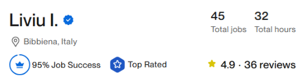

**Software Developer** with primary experience in **Python** and .NET **C#**, passionate about Artificial Intelligence, Data Analysis, and building reliable software solutions. Also an experienced scripts programmer specializing in financial automation and trading algorithms, proficient in **MQL4**, **MQL5**, and **Python**, leveraging these skills to enhance system robustness and reliability. Skilled in backtesting, data analysis, and integrating deep learning models for accurate forecasting and performance optimization.

## Technical Skills

## Certifications

### Freelance Profile

Script programmer with 45 projects on Upwork and 36 client reviews averaging 4.9/5. My work consistently delivers high-quality results, helping clients achieve their goals efficiently and reliably.

